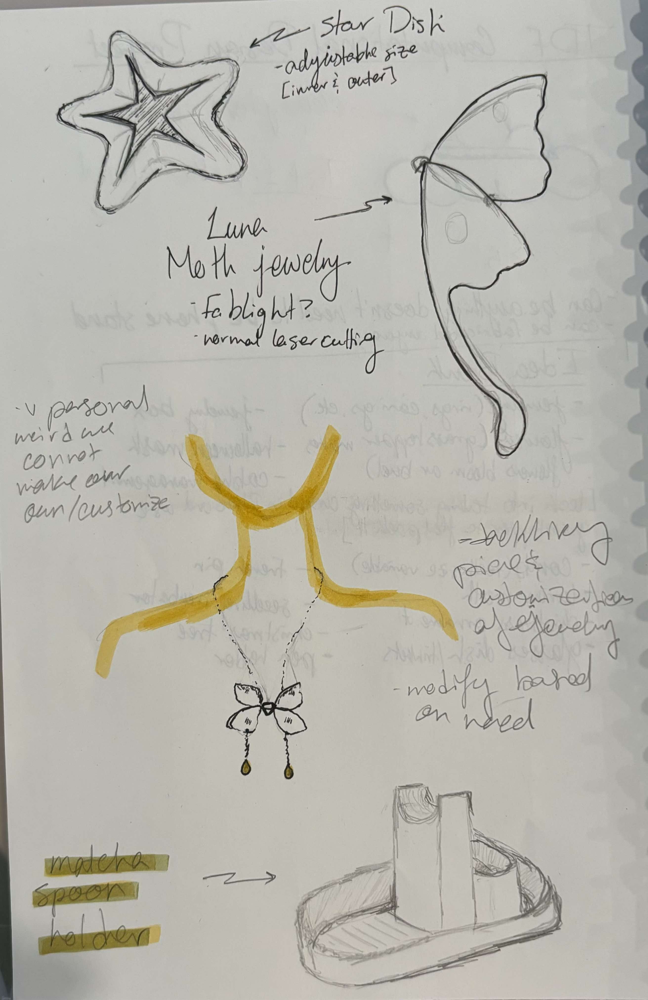
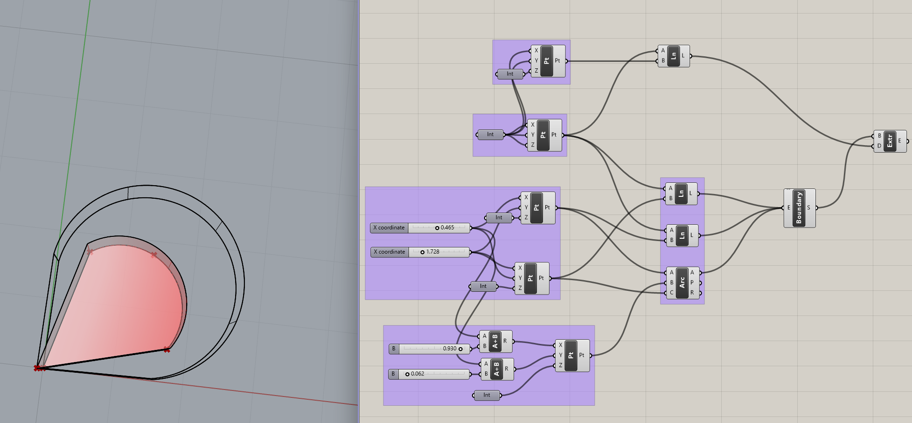
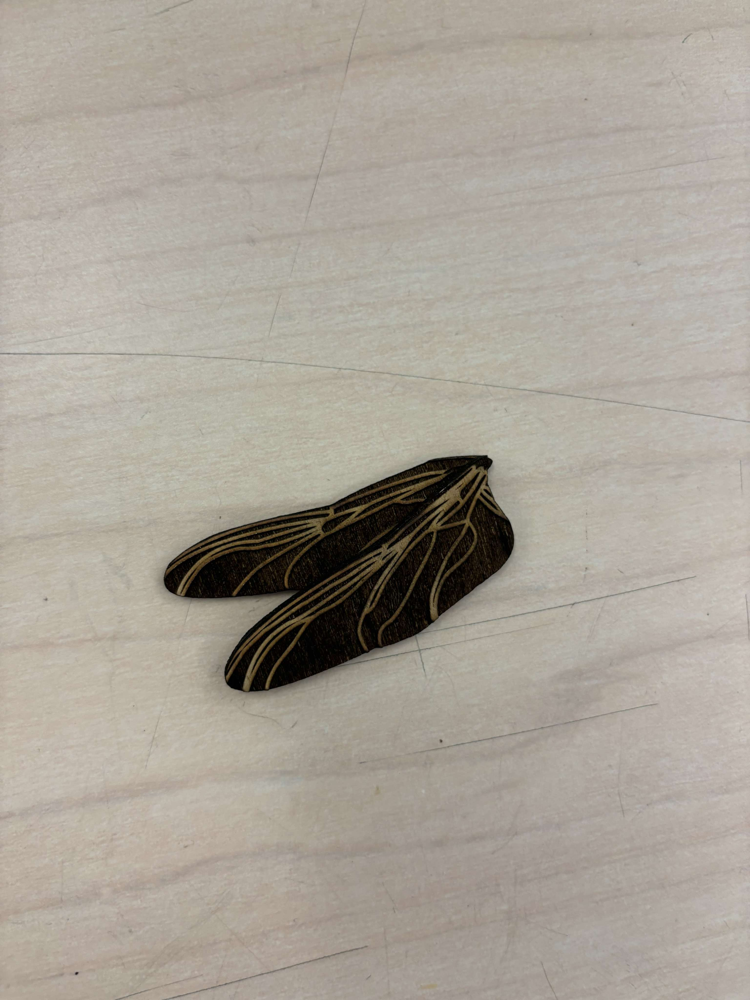
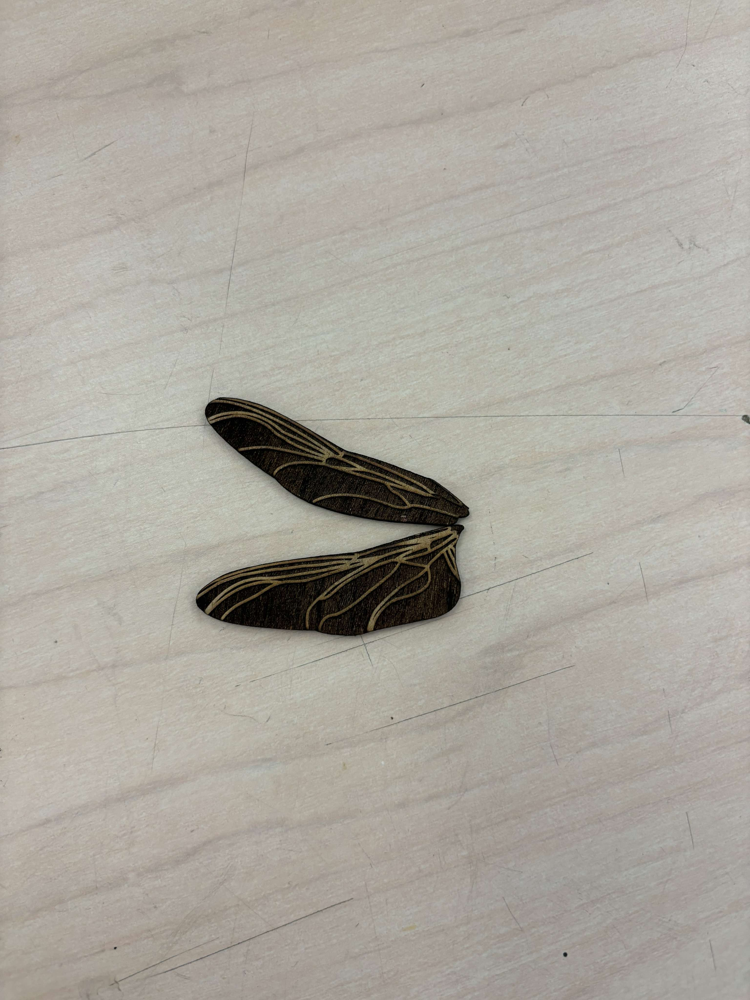

# ⭐Hanna Khoury's Amazing TDF Weekly Report Archive⭐
Come back every week to see what exciting things Hanna is learning and making!

---
 
# Table of Contents

👾[Week 1](README.md#week-1)  

👾[Week 2](README.md#week-2)  

👾[Week 3](README.md#week-3)  

👾[Week 4](README.md#week-4)  

👾[Week 5](README.md#week-5)   

Week 6 Coming Soon✨

---
# Week 5: Running thourgh the Photon Tutorial #
## Week of 10/03/2024

This week, I went through three of the Photon tutorials that were required of us, as well as the three "introductory" code. I also wanted to challenge myself, and wrote a blink code from scratch, and flashed it to my photon, to have the on board LED blink, and have the serial monitor print when the LED was on and when it was off.  

   

 
I did the button -> pulse rate, FSR->LED color, and Publish/Subscibe introduction tutorials. I found the first two tutorials to be straightforward, as I have coding and circuitry experience prior to this class. For the Publish/Subscribe tutorial, I worked alongside Roopa and used her photon as the additional device.  
For the button-> pulse rate tutorial, i found it pretty easy. It did require me to change the circuit compared to the tutorial, as the tutorial requested we use a four legged button, and we were only provided with two legged buttons. To achieve the tutorial, I put the resistor in series with the button, and managed to have the same outcome.  

https://github.com/user-attachments/assets/38f87b40-5109-4f4f-b34a-82566af19cce  

For the FSR -> LED color tutorial, I also had no difficulties, except with the pressure sensor itself. I found it to be not very sensitive, and had challenges with it sensing when I was pressing it.  

https://github.com/user-attachments/assets/6d4be4a8-3ec7-454e-a1a6-3b6205454dea  

For the last tutorial, I did the Publish/Subscribe introduction tutorial. This tutorial proved to be the most challenging, as the code that was in the downloadable file for "subscribe" was not the same as was published on the tutorial page. The code on the tutorial page worked, though I had to not replace the "publish" code in entirety, and kept components of it. I worked with Roopa, and we exchanged turns with which photon would "publish" and which would "subscribe". 

       

Overall, I found the tutorials easy. Reflecting on the differences between the code of these tutorials, in comparison to the tutorials taht we explored in class on monday, these have a lot more "constants" to identify the pins. As well, these tutorials contain functions. I have a basic understanding of functions, and am looking forward to exploring them more, and becoming more comfortable with coding architecture. In the future, it will be interesting to see how these funtions can be used in combinations to develop a more complex physical system. 

# Week 4: Analyzing my Device Ecosystem #
## Week of 09/26/2024

This week, in preparation for the second project, and for the homework, I brainstormed what devices and platforms I used on a regular basis, and due to the fact that I do not support the over complication of household processes and am careful to have to omuch of my data recorded, the only ecosystem that collects my data on a daily basis (that I am aware of and consent to) is my health and fitness tracking ecosystem. I created a concept maps of the different technologies and platforms that I use to collect and analyze my health and fitness data.  
 
 
  
 Going in to the future, corporations will attempt to collect even more of users' personal data, for botht their own internal analysis to track the usage of their products to be able to make better products, as well as continuing to sell our data for additional profit. I think there is a serious conversation that we as designers using emerging technology need to have regarding the collection, storage, and usage of consumer data. As well as users, we need to discuss "Is convenience worth having our data being sold without our consent?" 

# Week 3: Working on Project 1 #
## Week of 09/09/2024

This week, I continued to work on my computational design project. I started by creating a customizable tear drop shape, then moved into creating a shape more similarly to a wing. I first started with ideation and sketches

   
 
   

 Then I started making some experiments.
 
   
 
   

  After sitting in for some of Cody's office hours in the makerspace, I decided to have both wings be placed in the grasshopper file, as well as all the additional componant, and have them set up so that the user can laser cut their pieces.   
 
   
Having worked on this project very intensly the past week, I am quite proud of the progress that I made in a software that I had never used prior to this class. I hope i will be able to continue to develop my experience in Rhino and Grasshopper, and find more uses that are more applicable to my envisioned career path. 

# Week 2: Becoming Better Aquainted with Grasshopper #
## Week of 09/19/2024

Over the weekend I tried to continue to go over the grasshopper tutorials, and was struggling a bit to understand how to read the files and create my own. I was able to play around with the sliders though, and that did help me understand a bit about how Grasshopper functioned (Images 2 and 3).  

  
   

During the class on Monday though, I attened the Grasshopper workshop, and understood a lot more of the structure, and the software really clicked with me. Looking to the future, I know that I tend to learn better from in-person workshops and tutorials, so I will strive to attend any office hours and workshops that are available to me.    

 

 

After the workshop, I wanted to play around myself with creating shapes, and merging bodies together to create more complex shapes. Coming from a mechanical engineering background, where I am used to using SolidWorks, it has been a bit challenging to switch my thinking process around CAD from Solidworks to Rhino/Grasshopper. I wanted to test out creating an adjustable cloud shape.  

 
 
 

I made this shape so that the radii of the cloud shperes could be changed, and therefore their placement relative to each other. However, while trying to create a shortcut to make a cloud shape, I accidentally created a croissant. While this was not the intended outcome, it was fun. I am not sure if the shapes actually "merged" together, and if I used the right command to do so, That is another aspect that I would like to take another look at.

 
   

# Week 1: Introduction to the Maker Space #
## Week of 09/02/2024

This week, I wanted to become aquainted with the lasercutters and 3D printers available to me at Jacobs. I decided to alter a project I had worked on in the past, and make some wooden Dragonfly wing charms, for earings or a keychain. I made a mistake in my design, and accidentally cut off the rings, so I will alter the product to be a magnet, and I may in the future reattempt this design. I would also want to play around with different raster values, to have a cleaner look, and not have the wood look too singed. 
I also participated in the Form 3, and the Objet Connex workshops, to aquaint myself with the other printers we have accesible to us. 

 
-------------------------------------------------

## Quick Links, compiled here for your convenience: ##

- [TDF Wiki](https://github.com/Berkeley-MDes/24f-desinv-202/wiki) - the ultimate source for truth and information about the course and assignments
- [Google Drive Folder](https://drive.google.com/drive/u/0/folders/1DJ1b6sSDwHXX6NRcQYt10ivyQSgU0ND6) - slides and other resources
- [bCourses](https://bcourses.berkeley.edu/courses/1537533) - where the grading happens
- [Weekly Personal Reflection](https://forms.gle/PwfMSrZYMreGmetA7) - link for the weekly reflection submissions
